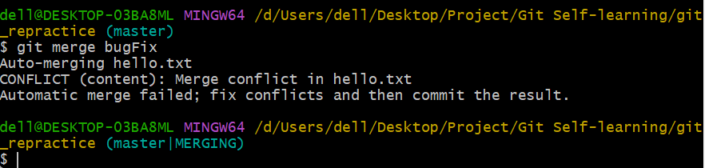
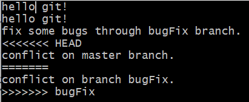

# [Git教程](https://www.bilibili.com/video/BV1vy4y1s7k6?p=9&spm_id_from=pageDriver&vd_source=63206fd8c4f29e8ad05ffbc0582e6040)

## Git概述

## Git安装

## Git常用命令

### 设置用户签名

```
git config --global user.name 用户名
```
```
git config --global user.email 虚拟邮箱
```
*注意*：这里设置的用户签名和将来登录GitHub\\Gitee的账号没有任何关系

### 初始化本地库

```
git init
```

### 查看本地库状态

```
git status
```

### 添加暂存区

添加单个文件到暂存区
```
git add 文件名
```

添加所有文件到暂存区
```
git add .
```

取消添加到暂存区
```
git rm --cached 文件名
```

### 提交本地库

提交单个文件到本地库
```
git commit -m "日志信息" 文件名
```

提交所有文件到本地库
```
git commit -m "日志信息"
```

添加并提交项目
```
git commit -am "日志信息" （文件名）
```

追加提交，即在不增加一个新的提交的情况下，将新修改的代码/日志信息追加到前一次的提交中
```
git commit --amend
```

### 推送至远端

```
git push
```

### 查看历史版本

查看简略历史版本
```
git reflog
```

查看详细历史版本
```
git log
```

查看美化历史版本
```
git log --pretty=oneline
```

### 删除文件

从版本库中恢复已被删除的文件
```
git restore 文件名
```

### 版本穿梭

```
git reset --hard 版本号
```

*注意*：Git切换版本，底层其实是移动的HEAD指针 

## Git分支操作

### 查看分支

```
git branch -v
```

### 创建分支

```
git branch 分支名
```

### 切换分支

```
git checkout 分支名
```

创建分支同时切换到该分支
```
git checkout -b 分支名
```

### 合并分支

将目标分支合并到当前所在分支上
```
git merge 分支名
```

将当前分支里所有的工作复制拷贝，并挂到该分支上
```
git rebase 分支名
```

把分支2里的工作复制拷贝，并挂到分支1上
```
git rebase 分支1 分支2 
```

*注意*：
- `git merge`：把这两个 parent 节点本身及它们所有的祖先都包含进来；
- `git rebase`：取出一系列的提交记录，“复制”它们，然后在另外一个地方逐个的放下去，以创造更线性的提交历史

#### `rebase`的优缺点
- 优点：`rebase`使你的提交树变得很干净, 所有的提交都在一条线上
- 缺点：`rebase`修改了提交树的历史

#### 产生冲突





#### 解决冲突

打开冲突的文件；

`<<<<<<<`与`=======`之间是当前分支的代码，`=======`与`>>>>>>>`之间是目标分支的代码；

二者产生冲突，需手动选择保留哪部分的代码

### 在提交树上移动——分离HEAD

检出提交历史中的某次提交记录
```
git checkout SHA 
```

撤销上一个操作，回到分支main
```
git switch -
```

*注意*：检出后，
- 既可以撤销 `git switch -`，或返回最后一次提交 `git checkout 分支名`
- 也可以放弃最近所做的工作并选择以前的提交 `git switch -` + `git reset --hard SHA`

### 相对引用

使用`^`向上移动 1 个提交记录
```
git checkout 分支名/HEAD^
```

使用`~<num>`向上移动多个提交记录，如`~3`
```
git checkout 分支名/HEAD~<num>
```

有多个 parent 节点的情况下，用`^\<num>`指定合并提交记录的某个 parent 提交
```
git checkout 分支名/HEAD^<num>
```
注意：`~<num>`、`^`和`^<num>`可以混用
e.g.
```
git checkout HEAD~^2~2
```

创建分支，并将该分支强制指向某次提交
```
git branch -f 分支名 分支名/HEAD~<num>/HEAD^/SHA
```
*注意*：直接使用`-f`选项强制让分支指向另一个提交

### 撤销变更

把分支记录回退几个提交记录来实现撤销改动
```
git reset --hard HEAD~<num>/HEAD^/SHA
```

创建某次提交记录的副本，加在当前分支下，可以撤销更改并分享给别人
```
git revert HEAD~<num>/HEAD^/SHA
```

*注意*：
- `git reset` 向上移动分支，原来指向的提交记录就跟从来没有提交过一样，但是这种“改写历史”的方法对大家一起使用的远程分支是无效的；
- `git revert` 通过创建一个新的提交，把你的更改推送到远程仓库与别人分享

### 整理提交记录

将`SHA_1`、`SHA_2`……提交到当前分支下
```
git cherry-pick SHA_1 SHA_2 ......
```

交互式的`rebase`
```
git rebase -i HEAD~<num>/HEAD^/SHA
```

*注意*：Git 会打开打开一个 UI 界面并列出将要被复制到目标分支的备选提交记录，此时可以
- 调整提交记录的顺序
- 删除不想要的提交
- 合并提交
  
*注意*:
- `git cherry-pick` 多用于已知提交记录的SHA情况；
- `git rebase -i` 多用于不清楚提交记录的SHA的情况
  
### 标签

创建标签
```
git tag 标签名 HEAD~<num>/HEAD^/SHA
```

描述离得最近的标签
```
git describe <ref>(HEAD~<num>/HEAD^/SHA)
```
输出结果：`<tag>_<numCommits>_g<hash>`
其中，`tag`表示的是离`ref`最近的标签，`numCommits`是表示这个`ref`与`tag`相差有多少个提交记录，`hash`表示的是你所给定的`ref`所表示的提交记录哈希值的前几位。
*注意*：当`ref`提交记录上有某个标签时，则只输出标签名称

### 远程仓库操作

#### 获取远程的数据

将本地仓库中的远程分支更新成了远程仓库相应分支最新的状态 
```
git fetch
```
*注意*：仅下载相应远程仓库的最新状态，并不更新本地代码

#### 更新本地数据
先获取远程仓库的最新状态，再和本地分支合并
```
git pull
```
*注意*：
- `git pull`是`git fetch`和`git merge`的合并

```
git pull --rebase
```
*注意*：
- `git pull --rebase`是`git fetch`和`git rebase`的合并；
- 用于`push`前，但本地和远端不同步的情况；
- 先通过`git pull --rebase`同步，再`git push`到远端

#### 推送本地仓库至远端
将本地变更上传到远程仓库，并在远程仓库上合并新提交记录
```
git push
```

#### 设置远程追踪分支
跟踪远程分支`o/main`

1. 通过远程分支切换到一个新的分支
```
git checkout -b 分支名 o/main
```

2. 
```
git branch -u o/main 分支名
```

### 参数

#### `git push`

##### 指定执行推送的分支
切到本地仓库的\<place>分支，获取所有的提交，再到远程仓库\<remote>中找到\<place>分支，将远程仓库中没有的提交记录都添加上去
```
git push <remote>(一般为origin) <place>
```

##### 来源与去向名称不同的分支之间的推送
同时为源和目的地指定\<place>，需要使用`:`进行连接
```
git push <remote>(一般为origin) <source>:<destination>
```
切到本地仓库的\<source>分支，获取所有的提交，再到远程仓库\<remote>中找到\<destination>分支，将远程仓库中没有的提交记录都添加上去

*注意*：如果要推送到的目的分支不存在，则 Git 会在远程仓库中根据提供的名称创建这个分支！

#### `git fetch`

##### 指定执行推送的分支
到远程仓库的 \<place> 分支上，然后获取所有本地不存在的提交，放到本地的 o\\\<place> 上
```
git fetch <remote>(一般为origin) <place>
```

*注意*：是本地的 o\\\<place> 分支，不是 \<place> 分支

##### 来源与去向名称不同的分支之间的推送
\<source>现在指的是远程仓库中的位置，而 \<destination> 才是要放置提交的本地仓库的位置
```
git fetch <remote>(一般为origin) <source>:<destination>
```

*注意*：如果执行命令前目标分支不存在，Git 会在`fetch`前自己创建立本地分支

##### 没有参数
下载所有的提交记录到各个远程分支
```
git fetch
```

在`git push`或`git fetch`时不指定任何 \<source>，仅保留冒号和 \<destination> 部分，\<source> 部分留空

删除远程仓库中的 \<destination> 分支
```
git push <remote>(一般为origin) :<destination>
```

在本地创建一个新分支 \<destination> 
```
git fetch <remote>(一般为origin) :<destination>
```


#### `git pull`
`git pull`实际上就是`fetch` + `merge` 的缩写, `git pull`唯一关注的是提交最终合并到哪里（也就是为`git fetch`所提供的 `destination` 参数）
```
git pull <remote>(一般为origin) <place>
```

```
git pull <remote>(一般为origin) <source>:<destination>
```

## 配置.gitignore文件

通常，`.gitignore`文件放在仓库的根目录下

### 忽略某个特定的文件

需要提供该文件在项目根目录下的完整路径

e.g. 忽略位于根目录下的`text.txt`文件
```
/text.txt
```

e.g. 忽略位于根目录下的`test`目录中的`text.txt`文件
```
/test/text.txt
```
或者
```
test/text.txt
```

### 忽略位于项目中任何地方的具有某特定名称的所有文件

不需要提供特定文件的完整路径

e.g. 忽略任何名称为`text.txt`文件
```
text.txt
```

e.g. 同时忽略任何名称带有`test`的文件和目录
```
test
```

### 忽略整个目录及其所有内容

需要包括目录的名称，并在最后加上斜线`/`

e.g. 忽略位于项目中任何地方的名为`test`的目录（包括目录中的其他文件和其他子目录）

```
test/
```

### 忽略任何以特定单词开头的的文件或目录

需要指定想忽略的单词，后面跟着`*`通配符选择器

e.g. 忽略所有名称以`img`开头的文件和目录

```
img*
```

### 忽略任何以特定单词结尾的文件或目录

需要使用`*`通配符选择器，后面跟想忽略的单词

e.g. 忽略所有以`.md`文件扩展名结尾的 markdown 文件

```
*.md
```

### 不想忽略某个文件

需要使用带有感叹号的否定模式，即`!`，来排除一个本来会被忽略的文件

e.g. 忽略所有以`.md`结尾的文件，但部忽略`README.md`文件

```
# 忽略所有 .md 文件
.md

# 不忽略 README.md 文件
!README.md
```

*注意*：如果忽略了整个目录，这个模式就不起作用

e.g. 已忽略了所有的`test`目录；但不想忽略在一个`test`文件夹中的example.md文件

不能像这样在一个被忽略的目录内排除一个文件：
```
# 忽略所有名字带有 test 的目录
test/

# 试图在一个被忽略的目录内排除一个文件是行不通的
!test/example.md
```

### 忽略以前提交的文件

*注意*：Git只能忽略尚未提交到仓库的未被追踪的文件，故必须在提交前将其添加到`.gitignore`文件中

e.g. 已经提交了一个存储环境变量的`.env`文件，但是现在想让Git忽略它

1. 更新`.gitignore`文件以包括`.env`文件；
2. 告诉Git不要追踪这个文件，把它从索引中删除；

从版本库中删除文件，但不删除本地系统中的文件
```
git rm --cached .env
```

从版本库和本地系统中删除该文件
```
git rm .env
```

3. 使用`git add`命令将`.gitignore`添加到暂存区
   
```
git add .gitignore
```

4. 使用`git commit`命令提交`.gitignore`文件

```
git commit -m "update ignored files"
```

## Git团队协作机制

### 团队内协作

### 跨团队协作

## GitHub操作步骤

### 创建远程仓库

### 远程仓库操作

#### 创建远程仓库别名

查看当前所有远程库别名
```
git remote -v 
```

创建远程库别名
```
git remote add 别名 远程库地址
```

#### 推送本地分支到远程仓库

```
git push 别名 分支
```

#### 拉取远程仓库到本地仓库

保证本地库与远程库同步
```
git pull 别名 分支
```

#### 克隆远程仓库到本地

```
git clone 远程库地址
```

*注意*：clone会做如下操作：
1. 拉取代码
2. 初始化本地仓库
3. 创建别名（自动设为origin）

### 团队内协作

- 仓库所有者在GitHub上邀请合作者成为远程仓库的成员；
- 合作者通过`push`将代码推送至远程库；
- 所有者通过`pull`将修改过的远程库同步到本地库

### 跨团队协作

- 在GitHub上将别人的远程库`fork`进自己的主页中；
- `clone`到本地修改，再`push`到远端\在线编辑；
- `pull requests`，并留言交流
- 仓库所有者审核修改，并留言交流;
- 同意合并 `merge pull request`

### SSH免密登录

## 码云Gitee

### GitHub项目导入码云

*注意*：GitHub上项目更新之后，码云上的项目需要强制同步

## GitHub Desktop

## 自建代码托管平台GitLab

GitLab是使用Git作为代码管理工具，并在此基础上搭建起来的web服务